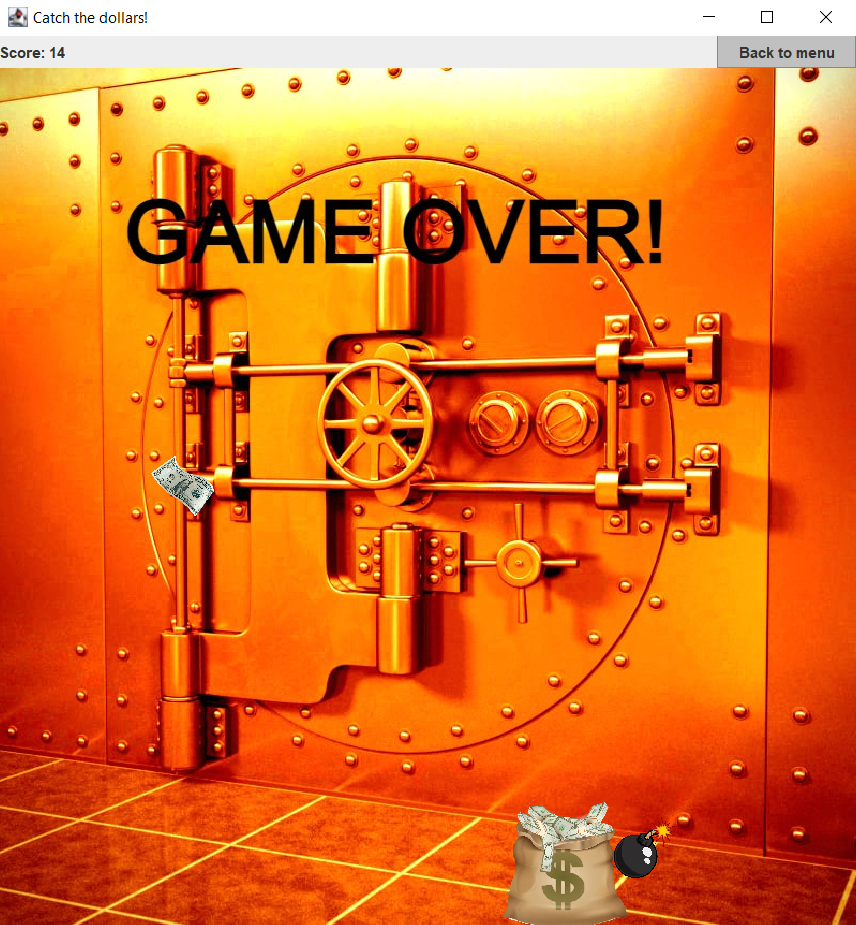

# 🎯 Catch the Dollars!

**Catch the Dollars!** is a simple and fun game implemented in **Java** where players catch falling dollars while avoiding obstacles.

## 📦 Installation

1. Clone or download this repository.
2. Compile and run the `Main.java` file in your preferred Java IDE or using the terminal.

## 🚀 How to Play

- Move your character to catch falling dollars.
- Avoid obstacles
- Check out the in-game **Help** section for detailed instructions!

Enjoy the game and beat your high score! 🎮

## 📸 Screenshots

  
  
  
  

